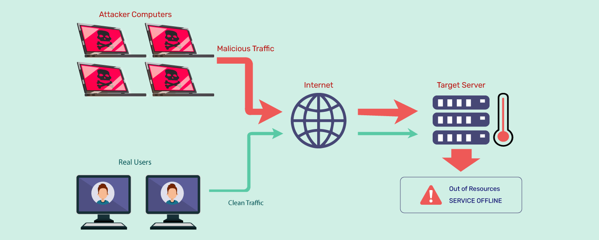

# DDOS Detection

## Issue description 
**Distributed Denial of service (DDoS)**, attacks users from accessing the network and makes services unavailable or only partially available. The attacker floods the targeted machines or resources with excessive requests. The victim's incoming traffic originates from many different sources. Attackers use many (remotely) controlled computers to attack the victim. 
## Machine learning (ML) technique
In this project,the Naive Bayes technique is used to detect which if the request ddos or benign.
## Dataset
The [Dataset](https://www.kaggle.com/datasets/devendra416/ddos-datasets) is extracted from different IDS datasets that were produced in different years and different experimental DDoS traffic generation tools, it has more than 12 milion records (ddos and benign) and 85 features.

##  Instructions
Required packages:

ipaddress
```bash
pip install ipaddress
 ```
seaborn
```bash
pip install seaborn
 ```
pandas
```bash
pip install pandas
```
matplotlib
```bash
pip install matplotlib
```
sklearn
```bash
pip install -U scikit-learn
```
After downloading "ProjectCode.zip" and packages, you have two options of environments to run: 
#### Running on local jupyter notebook
 In this option, you must have a large space to import and build a model according to a large dataset.
#### Running on cloud platform 
Or use this option by using azure services in 
 [Machine Learning](https://azure.microsoft.com/en-us/services/machine-learning/), is a cloud-based solution for ML workload and provides an end-to-end machine learning platform to enable users to build and deploy models faster on Azure.
First, create a notebook for the project. Second, create a  [compute instance](https://docs.microsoft.com/en-us/azure/machine-learning/how-to-create-manage-compute-instance?tabs=python) to execute the written code. 


 

